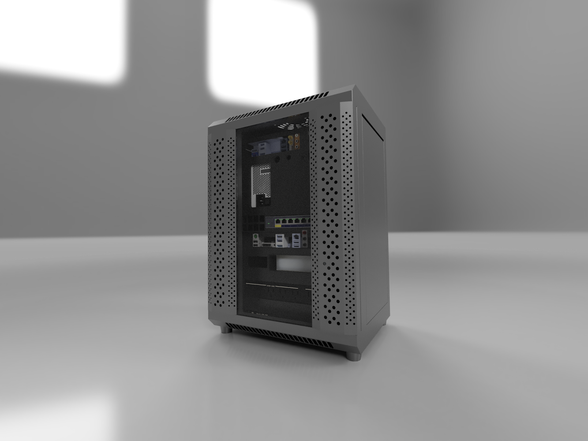

# dancard32/homelab

Welcome to my homelab server repository! This project serves as a personal exploration of DevSecOps principles and best software engineering practices, with the aim of creating a robust environment for experimentation and learning. I am excited to share this repository with the community, inviting others to run and learn alongside me. Together, we can dive into the world of server infrastructure, improve our skills, and foster a collaborative environment of knowledge sharing.

## Table of Contents
- [Installation](#installation)
    - [Building the Homelab](#building-the-homelab)
    - [Bare Metal Provisioning](#bare-metal-provisioning)
    - [Proxmox Set-Up](#proxmox-set-up)
    - [Kubernetes](#kubernetes)
- [Usage](#usage)
- [Features](#features)
- [Documentation](#documentation)
- [Contributing](#contributing)
- [License](#license)
- [Acknowledgements](#acknowledgements)
- [Contact or Support](#contact-or-support)

## Installation
To get started with the homelab server, first clone this repository (`git clone  https://github.com/dancard32/homelab.git`) and follow the steps below:

### Building the Homelab
The first step to setting up the homelab - is building your homelab! I would recommend firstly getting a main computer server up and running and running your needed services and making sure the VM's are working so that you can test your development environment.

After this point I would expand to suit your needs and add switches, Network Interface Cards (NICs), Wireless Access Points (WAPs), Network Attached Storage (NAS) when best suited.

For a detailed description of my set-up (If you wish to repeat it) can be found under the [building instructions](markdown/building.md)

### Bare Metal Provisioning
Prior to the deployment of VM's, docker containers, kubernetes clustering is the initial software dependencies set-up of the main server computer. This set-up is what I have labeled [bare metal provisioning](markdown/provisioning.md)

### Proxmox Set-Up
Setting up Proxmox and the automation of VM cloning can be found in this [reference document](markdown/proxmox.md)

### Kubernetes
Steps to initialize and deploy a kubernetes cluster can be found in the following [reference document](markdown/k3s.md)

## Usage
In my personal own use case, I have been mainly using my homelab as a hands-on platform to dive deeper into the principles of DevSecOps, gain practical expertise in IT automation through Ansible, and explore the intricate convergence of software engineering and hardware integration such as:

1. **Learning and Skill Development**: Homelabs offer an ideal environment for hands-on learning, enabling experimentation, software testing, and configuration practice.
2. **DevOps and Infrastructure Testing**: Homelabs simulate production environments, allowing exploration of deployment strategies, orchestration tools, containerization, and automation frameworks.
3. **Software Development and Testing**: Homelabs provide isolated spaces to build and test applications, mimicking production environments for debugging, testing, and code iteration.
4. **Virtualization and Server Consolidation**: Homelabs optimize hardware resources by running multiple VMs or containers, consolidating services onto a single server for OS and network configuration experiments.
5. **Data Storage and Backup**: Homelabs facilitate personal data storage and backup solutions, including NAS setup, backup strategies, and data replication exploration.
6. **Home Automation and IoT**: Homelabs serve as centralized hubs for managing and integrating IoT devices, enabling home automation systems and experimentation with smart technologies.
7. **Cybersecurity and Penetration Testing**: Homelabs offer controlled environments for exploring cybersecurity concepts, conducting penetration testing, and strengthening defensive strategies.
8. **Media Streaming and Entertainment**: Homelabs support media servers, enabling streaming, accessing media files across devices, and creating personalized media centers with transcoding and streaming technologies.

## Features

- **Hardware Provisioning with Ansible**
- **VM Cloning Managed with Ansible**
- **Kubernetes Cluster Managed with Ansible**
- **Docker Compose Service Management**
- **Bill of Materials**
- **STL Files for Homelab Shelves**

## Documentation
No documentation yet, may have a wiki page for this project - not sure how useful it would be

## Contributing
Feel free to contribute to this project! Clone/Fork this repository and if you come across an issue feel free to open an issue (using the Bug or Feature request templates). If you have any changes and would like to merge into the main branch create a merge review and I will look over when I have time!

## License
No license, I would like to keep this is open-source, I just wish for some acknowledgement if you heavily use this codebase in your work :)

_p.s. If you somehow manage to make a significant amount of money you should..._

 _hehe_

## Acknowledgements
Show appreciation for and acknowledge the incredible help from the following community content creators:
- Techno Tim - [Github](https://github.com/timothystewart6), [YouTube](https://www.youtube.com/@TechnoTim)
- Jeff Geerling - [Github](https://github.com/geerlingguy), [YouTube](https://www.youtube.com/@JeffGeerling)
- Network Chuck - [Github](https://github.com/theNetworkChuck), [YouTube](https://www.youtube.com/@NetworkChuck)
- [r/homelab](https://www.reddit.com/r/homelab/)
- [r/minilab](https://www.reddit.com/r/minilab/)
- [Ask Ubuntu](https://askubuntu.com/)

## Contact or Support
If you are running into any issues first try forums to see if it is hardware specific - I doubt that I will enough time to directly respond to all invoices. If you are unable to pin-point an easy fix please open an issue as either a bug or feature for me to see. If it is security related, please email me at dcard@umich.edu

## Frequently Asked Questions (FAQ)
Here is a list of commonly asked questions:

- **Do you have any references to how you learned everything about homelabs?** Yes, and it has been documented [here in references](markdown/references.md)