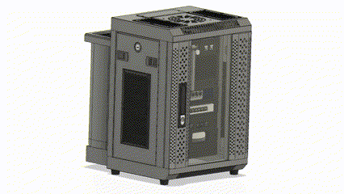

# dancard32/homelab

Welcome to my homelab server repository! This project serves as a personal exploration of DevSecOps principles and best software engineering practices, with the aim of creating a robust environment for experimentation and learning. I am excited to share this repository with the community, inviting others to run and learn alongside me. Together, we can dive into the world of server infrastructure, improve our skills, and foster a collaborative environment of knowledge sharing.

  

<!------>

## Table of Contents

- [Getting Started](#installation)
  - [Building the Homelab](markdown/building.md)
  - [Configuring Homelab](markdown/configuration.md)
  - [Bare Metal Provisioning](markdown/provisioning.md)
  - [Proxmox Set-up](markdown/proxmox.md)
  - [Kubernetes Set-up](markdown/k3s.md)
- [Usage](#usage)
- [Features](#features)
- [Contributing](#contributing)
- [License](#license)
- [Acknowledgements](#acknowledgements)
- [Contact or Support](#contact-or-support)

## Getting Started

To get started with the homelab server, first clone this repository (`git clone  https://github.com/dancard32/homelab.git`) and follow the steps below:

- [Building the Homelab](markdown/building.md)
- [Configuring Homelab](markdown/configuration.md)
- [Bare Metal Provisioning](markdown/provisioning.md)
- [Proxmox Set-up](markdown/proxmox.md)
- [Kubernetes Set-up](markdown/k3s.md)
- [Deploying Kubernetes Pods](markdown/deploying_k3s.md)

## Usage

In my personal own use case, I have been mainly using my homelab as a hands-on platform to dive deeper into the principles of DevSecOps, gain practical expertise in IT automation through Ansible, and explore the intricate convergence of software engineering and hardware integration.

This repository contains a `docker-compose.yml` file with most typical homelab container services and configured to allow an easy set-up for a fresh homelab. In general, the overall layout of this homelab and its features are:

- Hardware Provisioning with Ansible
- Docker Compose Service Management
- VM Cloning Managed with Ansible
- Kubernetes Cluster Managed with Ansible

## Contributing

Feel free to contribute to this project! Clone/Fork this repository and if you come across an issue feel free to open an issue (using the Bug or Feature request templates). If you have any changes and would like to merge into the main branch create a merge review and I will look over when I have time!

## License

No license, I would like to keep this is open-source, I just wish for some acknowledgement if you heavily use this codebase in your work :)

However, I would greatly appreciate it if you were to ...

## Acknowledgements

Show appreciation for and acknowledge the incredible help from the following community content creators:

- Techno Tim - [Github](https://github.com/timothystewart6), [YouTube](https://www.youtube.com/@TechnoTim)
- Jeff Geerling - [Github](https://github.com/geerlingguy), [YouTube](https://www.youtube.com/@JeffGeerling)
- Network Chuck - [Github](https://github.com/theNetworkChuck), [YouTube](https://www.youtube.com/@NetworkChuck)
- [r/homelab](https://www.reddit.com/r/homelab/)
- [r/minilab](https://www.reddit.com/r/minilab/)
- [Ask Ubuntu](https://askubuntu.com/)

## Contact or Support

If you are running into any issues first try forums to see if it is hardware specific - I doubt that I will enough time to directly respond to all invoices. If you are unable to pin-point an easy fix please open an issue as either a bug or feature for me to see. If it is security related, please email me at dcard@umich.edu

## Frequently Asked Questions (FAQ)

Here is a list of commonly asked questions:

- **Q: Do you have any references to how you learned everything about homelabs?**

  A: Yes, and it has been documented [here in references](markdown/references.md)

- **Q: How long did this project take?**

  A: Too long (70hrs CAD design, 80hrs and counting of development, 240hrs of 3D printing prototyping)
